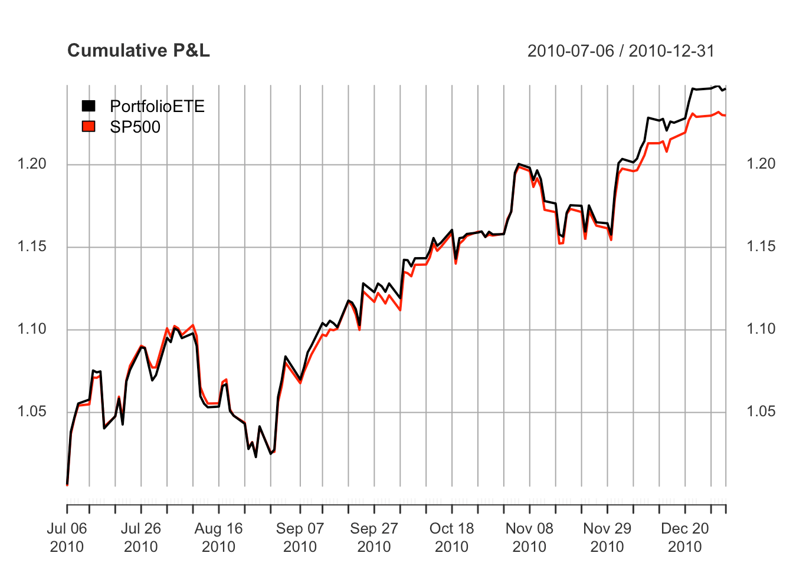
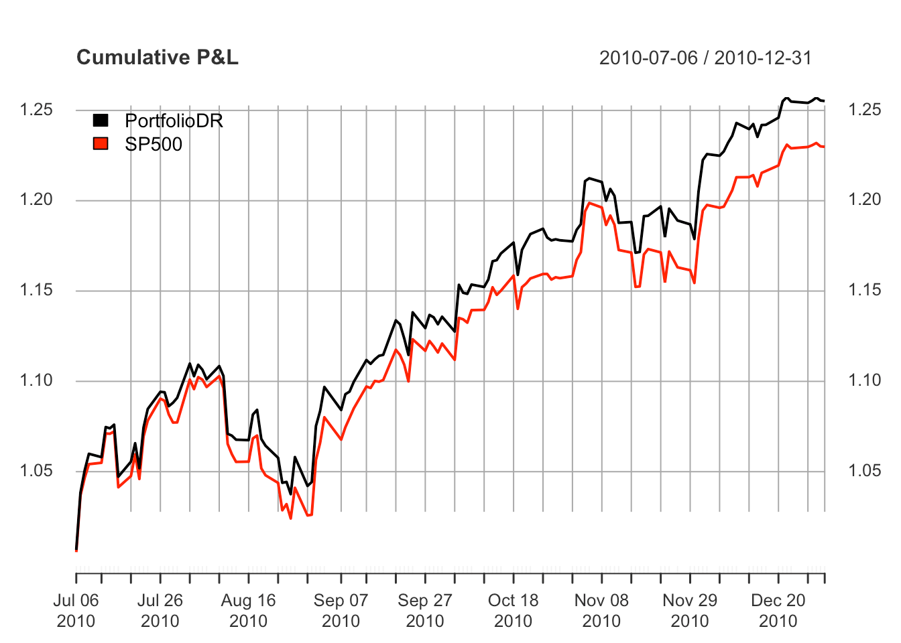
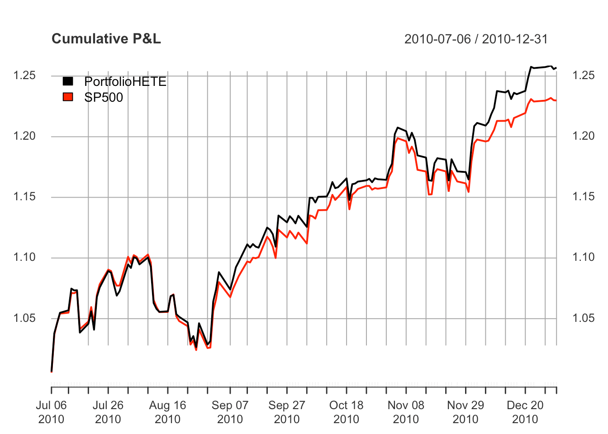
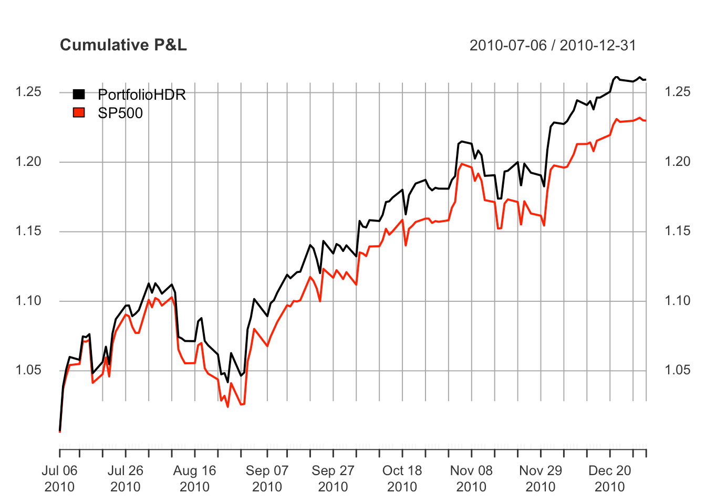

<!-- README.md is generated from README.Rmd. Please edit that file -->

sparseIndexTracking
===================

[](https://CRAN.R-project.org/package=sparseIndexTracking)
[](https://CRAN.R-project.org/package=sparseIndexTracking)


Computation of sparse portfolios for financial index tracking, i.e.,
joint selection of a subset of the assets that compose the index and
computation of their relative weights (capital allocation). The level of
sparsity of the portfolios, i.e., the number of selected assets, is
controlled through a regularization parameter. Different tracking
measures are available, namely, the empirical tracking error (ETE),
downside risk (DR), Huber empirical tracking error (HETE), and Huber
downside risk (HDR). See vignette for a detailed documentation and
comparison, with several illustrative examples.

The package is based on the paper:

K. Benidis, Y. Feng, and D. P. Palomar, “Sparse Portfolios for
High-Dimensional Financial Index Tracking,” *IEEE Trans. on Signal
Processing*, vol. 66, no. 1, pp. 155-170, Jan. 2018.
(<a href="https://doi.org/10.1109/TSP.2017.2762286" class="uri">https://doi.org/10.1109/TSP.2017.2762286</a>)

The latest stable version of **sparseIndexTracking** is available at
<a href="https://CRAN.R-project.org/package=sparseIndexTracking" class="uri">https://CRAN.R-project.org/package=sparseIndexTracking</a>.

The latest development version of **sparseIndexTracking** is available
at
<a href="https://github.com/dppalomar/sparseIndexTracking" class="uri">https://github.com/dppalomar/sparseIndexTracking</a>.

Installation
------------

To install the latest stable version of **sparseIndexTracking** from
CRAN, run the following commands in R:

``` r
install.packages("sparseIndexTracking")
```

To install the development version of **sparseIndexTracking** from
GitHub, run the following commands in R:

``` r
install.packages("devtools")
devtools::install_github("dppalomar/sparseIndexTracking")
```

To get help:

``` r
library(sparseIndexTracking)
help(package = "sparseIndexTracking")
package?sparseIndexTracking
?spIndexTrack
```

Please cite **sparseIndexTracking** in publications:

``` r
citation("sparseIndexTracking")
```

Documentation
-------------

For more detailed information, please check the vignette: [CRAN
vignette](https://CRAN.R-project.org/package=sparseIndexTracking/vignettes/SparseIndexTracking.html)
and [GitHub
vignette](https://raw.githack.com/dppalomar/sparseIndexTracking/master/vignettes/SparseIndexTracking.html).

Usage of `spIndexTrack()`
-------------------------

We start by loading the package and real data of the index S&P 500 and
its underlying assets:

``` r
library(sparseIndexTracking)
library(xts)
data(INDEX_2010)
```

The data `INDEX_2010` contains a list with two xts objects:

> 1.  `X`: A *T* × *N* xts with the daily linear returns of the *N*
>     assets that were in the index during the year 2010 (total *T*
>     trading days)
> 2.  `SP500`: A *T* × 1 xts with the daily linear returns of the index
>     S&P 500 during the same period.

Note that we use xts objects just for illustration purposes. The
function `spIndexTracking()` can also be invoked passing simple data
arrays or dataframes.

Based on the above quantities we create a training window, which we will
use to create our portfolios, and a testing window, which will be used
to assess the performance of the designed portfolios. For simplicity,
here we consider the first six (trading) months of the dataset (\~126
days) as the training window, and the subsequent six months as the
testing window:

``` r
X_train <- INDEX_2010$X[1:126]
X_test <- INDEX_2010$X[127:252]
r_train <- INDEX_2010$SP500[1:126]
r_test <- INDEX_2010$SP500[127:252]
```

Now, we use the four modes (four available tracking errors) of the
`spIndexTracking()` algorithm to design our portfolios:

``` r
# ETE
w_ete <- spIndexTrack(X_train, r_train, lambda = 1e-7, u = 0.5, measure = 'ete')
cat('Number of assets used:', sum(w_ete > 1e-6))
#> Number of assets used: 45

# DR
w_dr <- spIndexTrack(X_train, r_train, lambda = 2e-8, u = 0.5, measure = 'dr')
cat('Number of assets used:', sum(w_dr > 1e-6))
#> Number of assets used: 42

# HETE
w_hete <- spIndexTrack(X_train, r_train, lambda = 8e-8, u = 0.5, measure = 'hete', hub = 0.05)
cat('Number of assets used:', sum(w_hete > 1e-6))
#> Number of assets used: 44

# HDR
w_hdr <- spIndexTrack(X_train, r_train, lambda = 2e-8, u = 0.5, measure = 'hdr', hub = 0.05)
cat('Number of assets used:', sum(w_hdr > 1e-6))
#> Number of assets used: 43
```

Finally, we plot the actual value of the index in the testing window in
comparison with the values of the designed portfolios:

``` r
plot(cbind("PortfolioETE" = cumprod(1 + X_test %*% w_ete), cumprod(1 + r_test)), 
     legend.loc = "topleft", main = "Cumulative P&L")
```



``` r
plot(cbind("PortfolioDR" = cumprod(1 + X_test %*% w_dr), cumprod(1 + r_test)),
     legend.loc = "topleft", main = "Cumulative P&L")
```



``` r
plot(cbind("PortfolioHETE" = cumprod(1 + X_test %*% w_hete), cumprod(1 + r_test)),
     legend.loc = "topleft", main = "Cumulative P&L")
```



``` r
plot(cbind("PortfolioHDR" = cumprod(1 + X_test %*% w_hdr), cumprod(1 + r_test)),
     legend.loc = "topleft", main = "Cumulative P&L")
```



Links
-----

Package: [CRAN](https://CRAN.R-project.org/package=sparseIndexTracking)
and [GitHub](https://github.com/dppalomar/sparseIndexTracking).

README file:
[CRAN-readme](https://CRAN.R-project.org/package=sparseIndexTracking/readme/README.html)
and
[GitHub-readme](https://github.com/dppalomar/sparseIndexTracking/blob/master/README.md).

Vignette:
[CRAN-html-vignette](https://CRAN.R-project.org/package=sparseIndexTracking/vignettes/SparseIndexTracking.html),
[CRAN-pdf-vignette](https://CRAN.R-project.org/package=sparseIndexTracking/vignettes/SparseIndexTracking-pdf.pdf),
[GitHub-html-vignette](https://raw.githack.com/dppalomar/sparseIndexTracking/master/vignettes/SparseIndexTracking.html),
and
[GitHub-pdf-vignette](https://docs.google.com/viewer?url=https://github.com/dppalomar/sparseIndexTracking/raw/master/vignettes/SparseIndexTracking-pdf.pdf).
