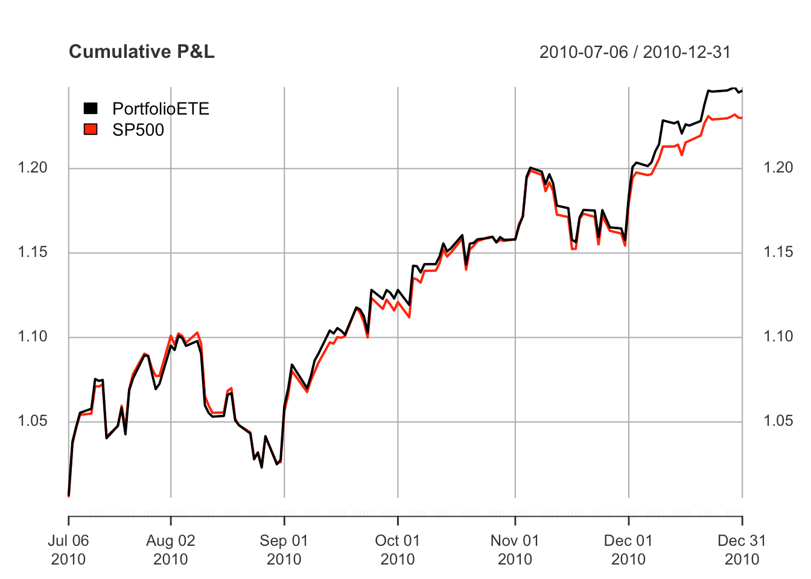

<!-- README.md is generated from README.Rmd. Please edit that file -->


# sparseIndexTracking

Computation of sparse eigenvectors of a matrix (aka sparse PCA)
    with running time 2-3 orders of magnitude lower than existing methods and
    better final performance in terms of recovery of sparsity pattern and 
    estimation of numerical values. 
    
Can handle covariance matrices as well as 
    data matrices with real or complex-valued entries. Different levels of 
    sparsity can be specified for each individual ordered eigenvector and the 
    method is robust in parameter selection. See vignette for a detailed 
    documentation and comparison, with several illustrative examples. 
    
The package is based on the paper:
    K. Benidis, Y. Feng, and D. P. Palomar, “Sparse Portfolios for High-Dimensional 
    Financial Index Tracking,” IEEE Trans. on Signal Processing, vol. 66, no. 1, 
    pp. 155-170, Jan. 2018 <https://doi.org/10.1109/TSP.2017.2762286>.


## Installation

```r
# Installation from CRAN
install.packages("sparseIndexTracking")

# Installation from GitHub
# install.packages("devtools")
devtools::install_github("dppalomar/sparseIndexTracking")

# Getting help
library(sparseIndexTracking)
help(package = "sparseIndexTracking")
package?sparseIndexTracking
?spIndexTrack

# Citing this work
citation("sparseIndexTracking")
```


## Usage of `spEigen()`

We start by loading the package and generating synthetic data with sparse eigenvectors:

```r
library(sparseEigen)
set.seed(42)

# parameters 
m <- 500  # dimension
n <- 100  # number of samples
q <- 3  # number of sparse eigenvectors to be estimated
sp_card <- 0.1*m  # cardinality of each sparse eigenvector

# generate non-overlapping sparse eigenvectors
V <- matrix(0, m, q)
V[cbind(seq(1, q*sp_card), rep(1:q, each = sp_card))] <- 1/sqrt(sp_card)
V <- cbind(V, matrix(rnorm(m*(m-q)), m, m-q))
# keep first q eigenvectors the same (already orthogonal) and orthogonalize the rest
V <- qr.Q(qr(V))  

# generate eigenvalues
lmd <- c(100*seq(from = q, to = 1), rep(1, m-q))

# generate covariance matrix from sparse eigenvectors and eigenvalues
R <- V %*% diag(lmd) %*% t(V)

# generate data matrix from a zero-mean multivariate Gaussian distribution 
# with the constructed covariance matrix
X <- MASS::mvrnorm(n, rep(0, m), R)  # random data with underlying sparse structure
```
Then, we estimate the covariance matrix with `cov(X)` and compute its sparse eigenvectors:

```r
# computation of sparse eigenvectors
res_standard <- eigen(cov(X))
res_sparse <- spEigen(cov(X), q)
```

We can assess how good the estimated eigenvectors are by computing the inner product with the original eigenvectors (the closer to 1 the better):

```r
# show inner product between estimated eigenvectors and originals
abs(diag(t(res_standard$vectors) %*% V[, 1:q]))  #for standard estimated eigenvectors
#> [1] 0.9215392 0.9194898 0.9740871
abs(diag(t(res_sparse$vectors) %*% V[, 1:q]))    #for sparse estimated eigenvectors
#> [1] 0.9986937 0.9988146 0.9972078
```

Finally, the following plot shows the sparsity pattern of the eigenvectors (sparse computation vs. classical computation):
<!-- -->

## Usage of `spEigenCov()`

The function `spEigenCov()` requires more samples than the dimension (otherwise some regularization is required). Therefore, we generate data as previously with the only difference that we set the number of samples to be `n=600`.


Then, we compute the covariance matrix through the joint estimation of sparse eigenvectors and eigenvalues:

```r
# computation of covariance matrix
res_sparse2 <- spEigenCov(cov(X), q)
```

Again, we can assess how good the estimated eigenvectors are by computing the inner product with the original eigenvectors:

```r
# show inner product between estimated eigenvectors and originals
abs(diag(t(res_sparse2$vectors[, 1:q]) %*% V[, 1:q]))    #for sparse estimated eigenvectors
#> [1] 0.9997197 0.9996029 0.9992848
```

Finally, we can compute the error of the estimated covariance matrix (sparse eigenvector computation vs. classical computation):

```r
# show error between estimated and true covariance 
norm(cov(X) - R, type = 'F') #for sample covariance matrix
#> [1] 48.42514
norm(res_sparse2$cov - R, type = 'F') #for covariance with sparse eigenvectors
#> [1] 25.74865
```


